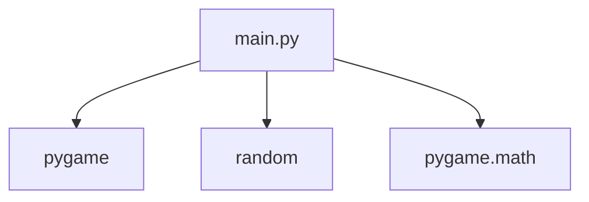
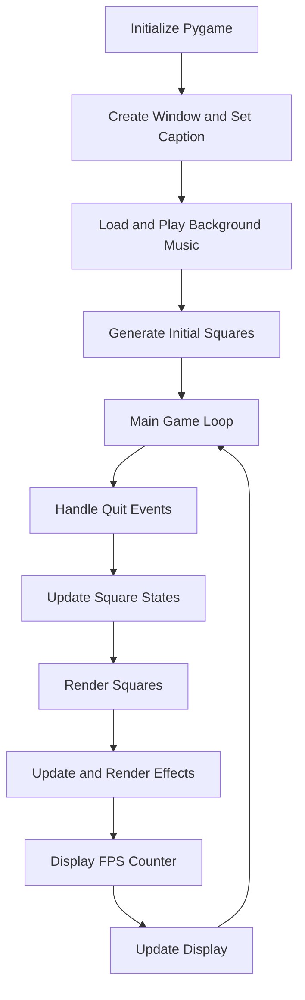
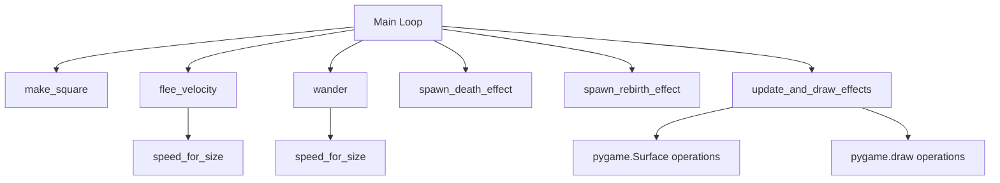

# Architecture Documentation

This document provides an overview of the architecture of the Pygame-based "Random Squares" simulation project.

## Dependency Graph

The project consists of a single Python file with the following module dependencies:



## High-Level System/Runtime Flow

The application follows a standard Pygame event loop structure:



## Function-Level Call Graph

The main loop invokes several functions to manage square behavior and effects:



Note: The `chase_velocity` function is defined but not currently used in the main loop.

## Sequence Diagram for Primary Execution Path

The following sequence diagram illustrates the primary execution flow from initialization to the main game loop:

```mermaid
sequenceDiagram
    participant M as main.py
    participant P as Pygame
    participant R as Random

    M->>P: pygame.init()
    M->>P: pygame.display.set_mode()
    M->>P: pygame.display.set_caption()
    M->>P: pygame.mixer.music.load()
    M->>P: pygame.mixer.music.play()
    loop For each square
        M->>R: randint() for position, size, color
        M->>R: uniform() for lifespan
        M->>M: make_square()
    end
    M->>M: Categorize big/small squares

    loop Main Loop
        M->>P: clock.tick()
        M->>P: pygame.event.get()
        alt Quit Event
            M->>M: Set run = False
        end
        M->>P: window.fill()
        loop For each square
            M->>M: Update age
            alt Age >= lifespan
                M->>M: spawn_death_effect()
                M->>R: Generate new square
                M->>M: spawn_rebirth_effect()
            else
                alt Small square
                    M->>M: flee_velocity()
                    M->>M: Update velocity
                else
                    M->>M: wander()
                end
                M->>M: Move square
                M->>M: Boundary checks
            end
            M->>P: pygame.draw.rect()
        end
        M->>M: update_and_draw_effects()
        M->>P: font.render() FPS
        M->>P: window.blit()
        M->>P: pygame.display.update()
    end
    M->>P: pygame.quit()
```</content>
<parameter name="filePath">c:\Users\polak\Documents\GitHub\lab8-pygame\docs\architecture.md